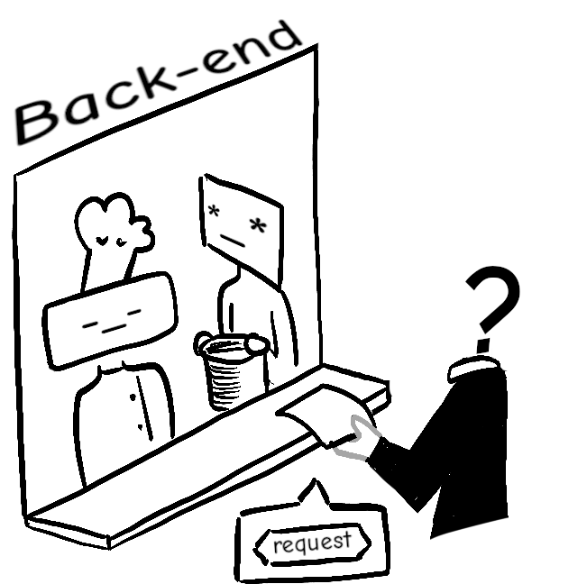
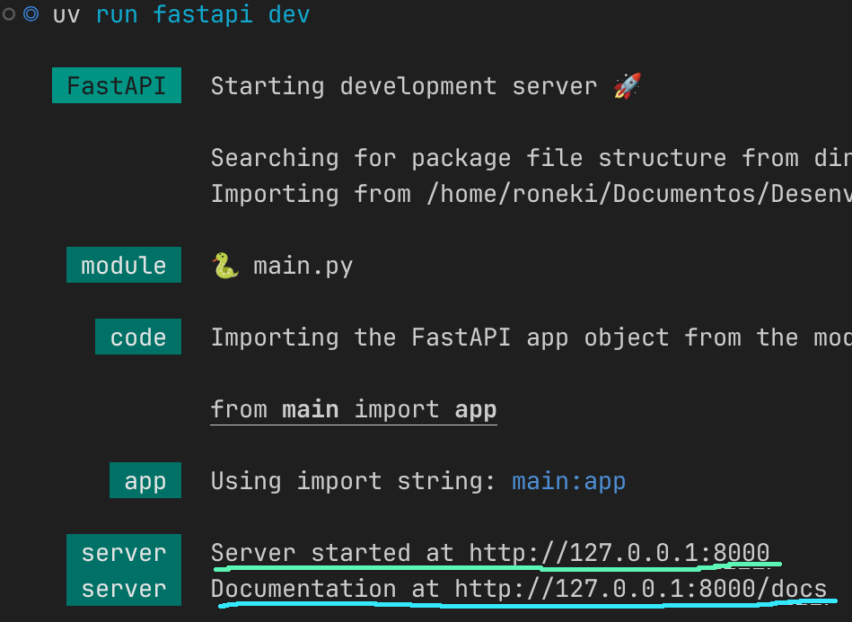

# Formação Backend: Python & FastAPI — O Caminho Sannin de Orochimaru

## Mushi Bingo


---


## Definição de back-end

O Backend é a camada oculta de uma aplicação, tudo aquilo que acontece nos "bastidores" e que o usuário final não enxerga diretamente.

- Regras de Negócio
- Segurança e Autenticação
- Comunicação com o Banco de Dados

---


## Definição de API

A API é a ponte que permite que dois softwares diferentes conversem entre si, trocando dados e funcionalidades de maneira segura e padronizada.

- Endpoints (Rotas)
- Métodos HTTP (Verbos)

---




---

## Definição do protocolo HTTP

O HTTP (HyperText Transfer Protocol) é a regra de comunicação padrão da internet. Ele dita como o cliente e o servidor conversam entre si.

- O cliente envia uma requisição dizendo o que quer
- O servidor processa, consulta o banco e devolve uma resposta.
- A conexão se encerra.

---

### Verbos HTTP

Os verbos HTTP são responsáveis por indicar a ação a ser executada para um dado recurso.
<br>

| Verbo HTTP | Ação                           | CRUD   |
| ---------- | ------------------------------ | ------ |
| GET        | Buscar / Ler informação        | READ   |
| POST       | Criar / Enviar nova informação | CREATE |
| PUT        | Atualizar algo existente       | UPDATE |
| DELETE     | Remover informação             | DELETE |

---

### Status Code

O HTTP Status Code é a resposta padronizada que o servidor envia de volta ao cliente para dizer, de forma imediata, o que aconteceu com a requisição.
<br>

| Categoria | Tipo de Resposta | Descrição                                                   |
| --------- | ---------------- | ----------------------------------------------------------- |
| 1xx       | Informativo      | informa que requisição foi recebida e está sendo processada |
| 2xx       | sucesso          | Indica que a requisição foi bem-sucedida                    |

---

| Categoria | Tipo de Resposta | Descrição                                                              |
| --------- | ---------------- | ---------------------------------------------------------------------- |
| 3xx       | Redirecionamento | Informa que mais ações são necessárias para completar a requisição     |
| 4xx       | Erro do Cliente  | Significa que houve um erro na requisição feita pelo cliente           |
| 5xx       | Erro do Servidor | Indica um erro no servidor ao processar a requisição válida do cliente |

**Dica:** É uma boa prática utilizar status code corretamente, isso ajuda o lado cliente compreender as resposta do lado servidor.

---

## Definição de Endpoints

Um Endpoint é a URL específica que o cliente acessa para interagir com a API.

- Cada endpoint está associado um recurso da API
- definem como os clientes devem formatar suas requisições
  - Com parâmetro
  - Sem parâmetro
  - Qual verbo HTTP utilizar

---

## Ambiente de Desenvolvimento

---

## Gerenciador de pacote (UV)

O [uv](https://docs.astral.sh/uv/getting-started/installation/) é um gerenciador de pacotes, ambientes virtuais e versões do Python extremamente rápido, desenvolvido pela empresa Astral e escrito na linguagem Rust.

**Para instalar**

```bash
# No linux
curl -LsSf https://astral.sh/uv/install.sh | sh
```

<br>

```powershell
# No Windows
powershell -ExecutionPolicy ByPass -c "irm https://astral.sh/uv/install.ps1 | iex"
```

---

## Passos iniciais

Para criar um projeto, utilize `uv init projeto`

```
# Uma estrutura como essa será criada

projeto
├── main.py
├── pyproject.toml
├── README.md
└── uv.lock
```

O próximo passo é abrir o projeto no VsCode e o terminal integrado com `CTRL+J`

---

## FastAPI

O [FastAPI](https://fastapi.tiangolo.com/) é um framework web moderno, de alta performance, projetado especificamente para a construção de APIs com [Python](https://www.python.org/downloads/).

**Para instalar**

```
# No linux e Windows
uv add "fastapi[standard]"
```

**Dica:** Verifique se está dentro da pasta (raiz) do projeto antes de instalar.

---

Vamos testar a instalação do FastAPI criando nosso primeiro endpoint (ou rota).

```python
# main.py

from http import HTTPStatus
from fastapi import FastAPI

app = FastAPI()


@app.get("/", status_code=HTTPStatus.OK)
def read_root():
    return {'message': 'Olá, Mundo!'}
```

- Para executar utilize `uv run fastapi dev` (modo desenvolvimento)

**Dica:** Na primeira vez que for executar o projeto, sincronize as dependências do projeto com o ambiente: `uv sync`

---

## Documentação automática

O FastAPI oferece duas alternativas para documentar a API.

- Swagger UI: `/doc`
- ReDoc: `/redoc`



---

## Criando outros endpoints (CRUD)

Após a linha `app = FastAPI()`, adicione `database = []` para emular um banco de dados temporário.

---

### Pydantic

O [Pydantic](https://pydantic.dev/docs/validation/latest/get-started) é uma biblioteca Python focada em validação de dados (entrada e saída) e gerenciamento de configurações usando Type Hints (tipagem do Python)

- Validação de Dados Estrita
- Erros Automáticos
- Serialização Inteligente

---

### Modelo de dados (schema)

O modelo de dados é onde consideramos tanto os dados recebidos do cliente quanto os dados que serão retornados a ele.

Para o primeiro endpoint

```python
# schema.py

from pydantic import BaseModel

# BaseModel é uma classe base para criar modelos Pydantic
class Message(BaseModel):
    message: str
```

```python
# agora a saída corresponde ao modelo
@app.get("/", status_code=HTTPStatus.OK, response_model=Message)
def read_root():
    return {'message': 'Olá, Mundo!'}
```

---

### Criando schema de entrada e saída

Também podemos padronizar qual modelo é esperado receber e qual vamos retornar

```python
#schema.py

from pydantic import BaseModel, EmailStr

# entrada
class UserSchema(BaseModel):
    username: str
    email: EmailStr # tipo e-mail
    password: str

# saída
class UserPublic(BaseModel):
    username: str
    email: EmailStr
    id: int
```

---

### Endpoint POST (created)

Serve para receber dados. Por exemplo, inserir um novo usuário no DB.

```python
from schema import UserDB, UserPublic, UserSchema

@app.post("/users/", status_code=HTTPStatus.CREATED, response_model=UserPublic)
def create_user(user: UserSchema):
    user_with_id = UserDB(
        **user.model_dump(),
        id=len(database) + 1,
    )
    database.append(user_with_id)

    return user_with_id
```

Ao final do arquivo `schema.py`, adicione `class UserDB(UserSchema): id: int`

---

### Endpoint GET (read)

Serve para listar dados.

```python

# schema.py
class UserList(BaseModel):
    users: list[UserPublic]

# main.py
from schema import UserList

@app.get("/users/", response_model=UserList, status_code=HTTPStatus.OK)
def read_users():
    return {"users": database}
```

---

### Endpoint PUT (update)

Serve para atualizar uma coleção dados.

```python

@app.put("users/{user_id}", response_model=UserPublic)
def update_user(user_id: int, user: UserSchema):

    user_with_id = UserDB(**user.model_dump(), id=user_id)
    database[user_id - 1] = user_with_id

    return user_with_id
```

Diferença entre `PUT` e `PATCH`:

- `PUT` atualiza por completo
- `PATCH` atualiza parcialmente

---

### HTTPException

A HTTPException é uma classe de exceção específica do FastAPI utilizada para interromper imediatamente a execução do código e retornar uma resposta de erro HTTP estruturada para o cliente.

---

### Caso exceção

No endpoint `put`, caso seja enviado um valor invalidado um error é gerado.

Solução (tratar o error)

```python
@app.put("/users/{user_id}", response_model=UserPublic)
def update_user(user_id: int, user: UserSchema):
    # caso de exceção
    if user_id > len(database) or user_id < 1:
        raise Exceção(
            status_code=HTTPStatus.NOT_FOUND, detail="Usuário não encontrado"
        )
    # restante do código

```

---

### Endpoint DELETE (delete)

Serve para deletar dado da base.

```python

@app.delete(
    "/users/{user_id}", response_model=UserPublic, status_code=HTTPStatus.OK
)
def delete_user(user_id: int):
    if user_id > len(database) or user_id < 1:
        raise HTTPException(
            status_code=HTTPStatus.NOT_FOUND, detail="Usuário não encontrado"
        )

    return database.pop(user_id - 1)
```

---

## Nana, o companheiro

- Responsável em passar as atividades do treinamento.
- Caraterísticas: carismático, meigo e bastante observador.
  

---

# Próximos tópicos

- Boas práticas em Python
- Revisão de Banco de Dados
- Estrutura de Pastas (projeto)
- Apresentar Projeto Weekly
- Criar Banco de dados

---

## Referencias

- [FastAPI do Zero](https://fastapidozero.dunossauro.com/4.0)
- [FastAPI](https://fastapi.tiangolo.com/)
- [UV](https://docs.astral.sh/uv/)
- [Pydantic](https://pydantic.dev/docs/validation/latest/get-started/)
- [Métodos de requisição HTTP](https://developer.mozilla.org/pt-BR/docs/Web/HTTP/Reference/Methods)
- [REST: Princípios e boas práticas](https://www.alura.com.br/artigos/rest-principios-e-boas-praticas)
- [5 dicas para fazer APIs melhores](https://www.youtube.com/watch?v=UEbm9mqFLTY)
- [Alembic](https://alembic.sqlalchemy.org/en/latest/)
- [SQLAlchemy](https://www.sqlalchemy.org/)
- [Ambiente Python Moderno 2025: UV, Ruff, Pyright, pyproject.toml e VS Code](https://www.youtube.com/watch?v=HuAc85cLRx0)

---

<!-- _paginate: skip -->


