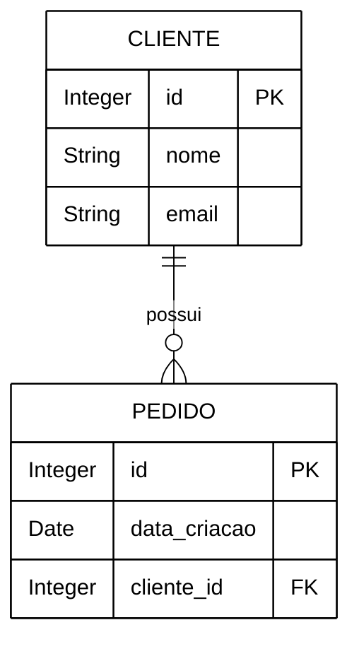
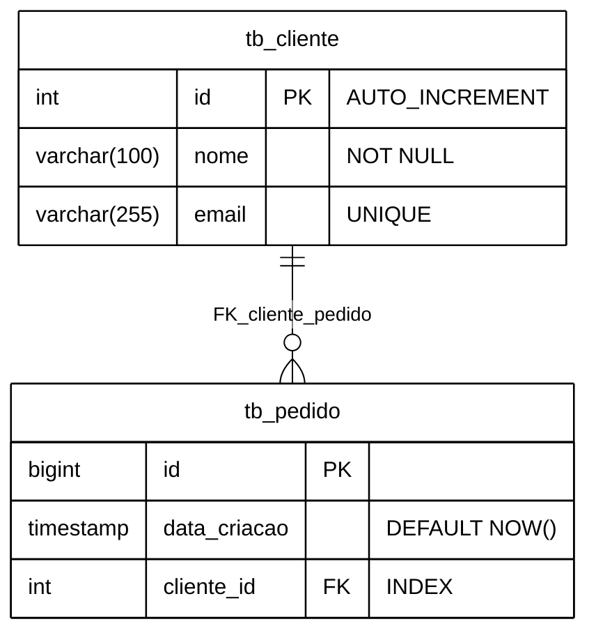
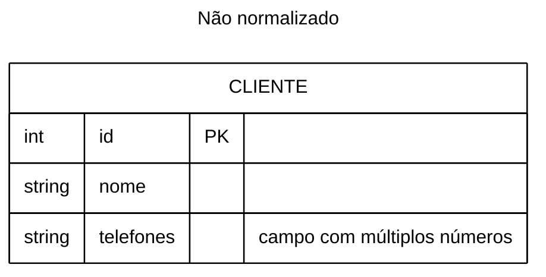
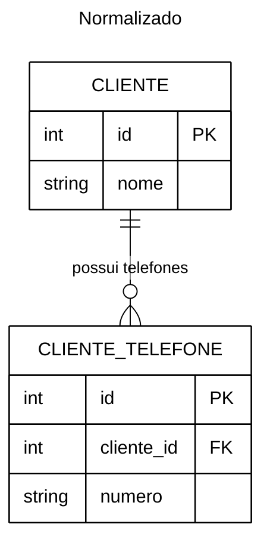
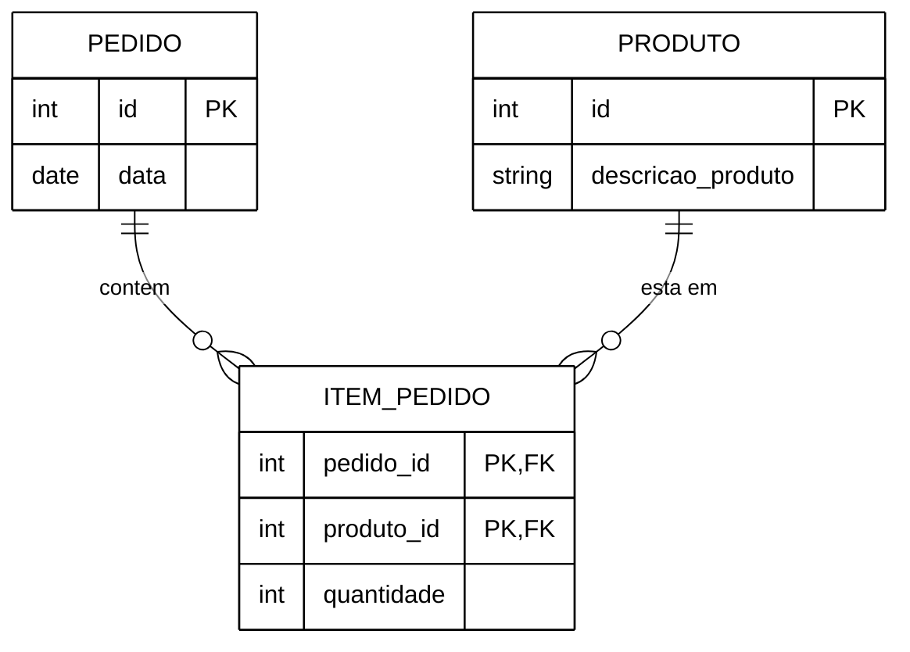
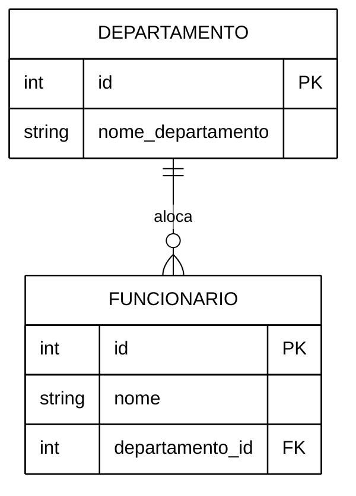
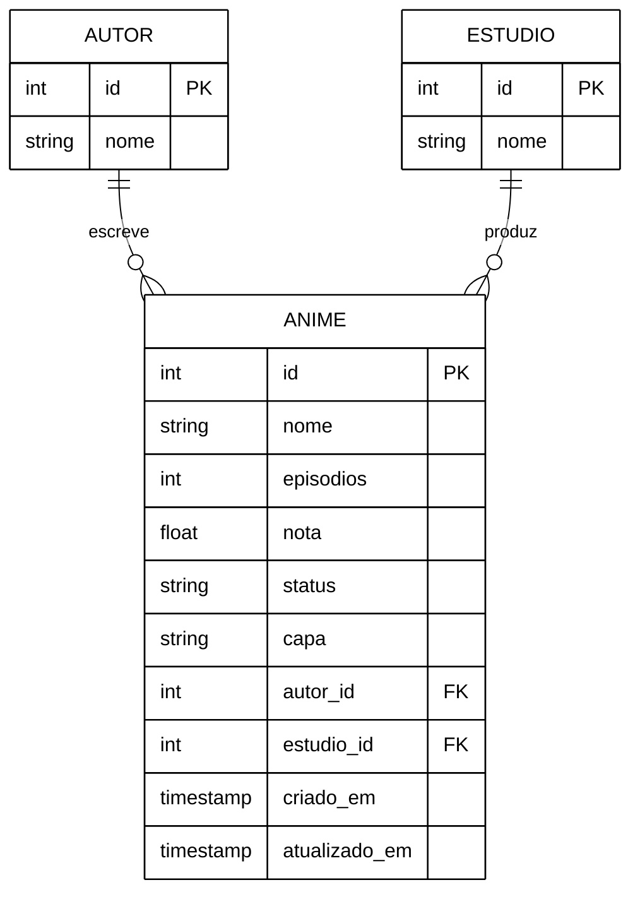

# Formação Backend: Python & FastAPI — O Caminho Sannin de Orochimaru

## Projeto Mushi Bingo

---

# Aula Anterior

- Definição de back-end
- Definição de API
- Definição do protocolo HTTP
  - Verbos HTTP
  - Status Code
- Definição de Endpoints
- Ambiente de Desenvolver
- CRUD


---

## Boas práticas em Python

### Estilo e legibilidade

- Indentação com 4 espaços
- Linha deve ter no máximo 79 caracteres
- Declarações
  - variáveis e funções em snake_case
  - classes em PascalCase
  - constantes em UPPER_SNAKE

**Dica:** Utilize ferramentas com `ruff` para garantir as boas práticas em Python

---

## Banco de Dados (Revisão) - SGBD

É um conjunto organizado de dados relacionados, armazenado e gerenciado de forma que permita inserção, consulta, atualização e remoção eficientes.

**Modelagem de Dados:**

- conceitual
- lógico
- físico

**Normalização:**

- 1FN
- 2FN
- 3FN

---

### Modelagem de Dados

#### Conceitual

Representação de alto nível dos dados e suas relações, independente de tecnologia.

- Objetivo: capturar entidades, atributos e relacionamentos entendidos pelos stakeholders.
- Independente do SGBD.

```text
    cliente:
    pedido

    pedido:
    produto

```

---

<div class="split-layout">
<div class="col-text">

#### Lógico

Mapeamento do modelo conceitual para estruturas lógicas (tabelas, colunas, chaves).

- Objetivo: definir chaves primárias/estrangeiras, cardinalidades e tipos de dados abstratos.
- Independente do SGBD.

</div>
<div class="col-graph">



</div>
</div>

---

<div class="split-layout">
<div class="col-text">

#### Físico

Implementação concreta no SGBD escolhido, com decisões de armazenamento, índices e tipos concretos.

- Objetivo: otimizar desempenho, armazenamento e integridade no ambiente de produção
- Dependente do SGBD.

</div>
<div class="col-graph">



</div>
</div>

---

### Normalização

#### Primeira Forma Normal (1FN)

Cada campo deve conter valores atômicos; eliminar grupos repetitivos/colunas multivaloradas.

- Objetivo: facilita consultas e evita redundância de dados dentro de uma tupla.

---

<div class="split-layout">
<div class="col-graph">



</div>

<div class="col-graph">



</div>
</div>

---

<div class="split-layout">
<div class="col-text">

#### Segunda Forma Normal (2FN)

Estar em 1FN e todos os atributos não-chave dependerem funcionalmente da chave primária inteira (eliminar dependências parciais).

- Objetivo: evitar duplicação quando a chave primária é composta.

</div>
<div class="col-graph">



</div>
</div>

---

<div class="split-layout">
<div class="col-text">

#### Terceira Forma Normal (3FN)

Estar em 2FN e nenhum atributo não-chave depender de outro atributo não-chave (eliminar dependências transitivas).

- Objetivo: reduzir anomalias de atualização e mantém integridade sem redundância desnecessária.

</div>
<div class="col-graph">



</div>
</div>

---

### Comandos básicos de SQL

- criar

```sql

CREATE TABLE clientes (
    id SERIAL PRIMARY KEY,
    nome VARCHAR(100) NOT NULL,
    email VARCHAR(255) UNIQUE
);

```

---

### Comandos básicos de SQL

- listar

```sql

SELECT id, nome, email
FROM clientes
WHERE nome = 'João Silva';

```

---

### Comandos básicos de SQL

- delatar

```sql

DELETE FROM clientes
WHERE id = 1;

```

---

### Comandos básicos de SQL

- inserir

```sql

INSERT INTO clientes (nome, email)
VALUES ('João Silva', 'joao@email.com');

```

---

### Comandos básicos de SQL

- atualizar

```sql

UPDATE clientes
SET email = 'novoemail@email.com'
WHERE id = 1;

```

---

### Boas práticas para banco de dados

#### Nomenclatura: Regras Gerais

- Padrão Snake Case:
  - _Correto:_ `data_nascimento`
  - _Incorreto:_ `DataNascimento`, `dataNascimento`
- Idioma Unificado
- Caracteres Permitidos
- Palavras Reservadas

---

#### Nomenclatura: Tabelas

- Sempre no Singular:
  - _Correto:_ `cliente`, `item_pedido`
- Evite prefixos como `tb_` ou `tbl_`.
  - _Correto:_ `usuario`
  - _Incorreto:_ `tb_usuario`

---

### Nomenclatura: Atributos (Colunas)

- Sempre no Singular:
  - _Correto:_ `nome`, `preco_unitario`
- Evite Redundância
  - _Correto:_ `nome`, `cpf`
  - _Incorreto:_ `nome_cliente`, `cpf_cliente`
- Seja Descritivo e Claro
  - _Correto:_ `quantidade_estoque`
  - _Incorreto:_ `qtd_est`

---

### Nomenclatura: Chaves (PK e FK)

- Chave Primária (PK): Utilizar simplesmente `id`.
- Chave Estrangeira (FK): Deve seguir a regra estrita de usar o nome da tabela referenciada no singular, seguido do sufixo `_id`.
  - _Exemplo em uma tabela de pedidos:_ `cliente_id`, `produto_id`.

---

## O projeto Mushi Bingo

Objetivo: Criar uma versão simplificada do MyAnimeList, permitindo cadastrar animes e acompanhar o status de cada um (assistindo, parado, assistido, planejo assistir).


---

### Diagrama RE

É uma representação visual que descreve a estrutura lógica de um banco de dados, facilitando a compreensão das regras de negócio pela equipe.

**Componentes fundamentais:**

- Entidades (tabelas)
- Atributos (colunas)
- Relacionamentos

---

<div class="col-graph">



</div>


---

### Regras de negócio: Fluxo de Status

**Fluxo de progresso:**

- `planejo_assistir` -> `assistindo` -> `assistido`
  - _Regra:_ Um anime só pode ser marcado como `assistido` depois de já ter passado por `assistindo`.

**Fluxo de pausa:**

- `assistindo` -> `parado` -> `assistindo`
  - _Regra:_ Um anime `parado` pode voltar a `assistindo` a qualquer momento.

---

### Regras de negócio: Nota

- A nota é opcional e vai de `0` a `10` (aceita casas decimais, ex: `8.5`).
- Só faz sentido atribuir nota quando o status for `assistindo` ou `assistido`.
  - _Regra:_ Se o status for `planejo_assistir`, a nota deve ser nula.

---

### Regras de negócio: Cadastro

- O campo `nome` do anime é obrigatório.
- `autor_id` e `estudio_id` são opcionais (nem todo anime tem essa informação cadastrada), mas quando informados devem referenciar um registro existente em `autor`/`estudio`.
- O campo `nome` em `autor` e `estudio` deve ser único, evitando cadastros duplicados do mesmo autor ou estúdio.
- O campo `episodios` representa o total de episódios da obra (não o progresso assistido).
- `criado_em` é preenchido automaticamente na criação do registro (`DEFAULT NOW()`).
- `atualizado_em` é atualizado automaticamente a cada modificação do registro.
- O campo `capa` é opcional e armazena apenas o **caminho/URL da imagem** salva no servidor — o arquivo em si não fica dentro do banco de dados.
  - _Nota:_ o recebimento do arquivo de imagem via `UploadFile` será visto em uma aula futura; por enquanto, `capa` é só mais uma coluna `string` na tabela.

---

### Endpoints (Sugestão): Autores

- `GET /autores` : Lista autores.
- `GET /autores/{id}` : Retorna um autor com os animes vinculados.
- `POST /autores` : Cria um novo autor.
- `PATCH /autores/{id}` : Atualiza dados do autor.

---

### Endpoints (Sugestão): Estúdios

- `GET /estudios` : Lista estúdios.
- `GET /estudios/{id}` : Retorna um estúdio com os animes vinculados.
- `POST /estudios` : Cria um novo estúdio.
- `PATCH /estudios/{id}` : Atualiza dados do estúdio.

---

### Endpoints (Sugestão): Animes

- `GET /animes` : Lista animes (Filtros: `?status=`, `?autor_id=`, `?estudio_id=`).
- `GET /animes/{id}` : Retorna um anime específico.
- `POST /animes` : Cria um novo anime.
- `PATCH /animes/{id}` : Atualiza dados (incluindo status e nota).
- `DELETE /animes/{id}` : Remove um anime da lista.
- `POST /animes/{id}/capa` : Recebe a imagem de capa do anime e salva o caminho no campo `capa`.
  - _Nota:_ implementado com [`UploadFile`](https://fastapi.tiangolo.com/reference/uploadfile/) do FastAPI.

---

## Estrutura de Pasta (Projeto)

```

mushi_bingo
├── app
│   ├── main.py
│   ├── models
│   ├── routers
│   ├── schema
│   └── settings.py
├── test
├── migrations
├── database.db
├── alembic.ini
├── .env
```

---

## ORM (Object-Relational Mapping)

É uma técnica de programação (ferramenta) que permite interagir diretamente com um banco de dados usando o paradigma de Orientação a Objetos da sua linguagem de programação, em vez de escrever consultas SQL puras.
<br>

- Abstração de banco de dados
- Segurança
- Eficiência no desenvolvimento

---

### SQLAlchemy

É o ORM mais robusto e tradicional do ecossistema Python. Ele abstrai a complexidade do banco de dados relacional, permitindo que você manipule tabelas e registros como se fossem classes e objetos Python nativos.

- Mapeamento Objeto-Relacional
- Abstração de Dialeto
- Gerenciamento de Sessão

**Para instalar**

```
# No linux e Windows
uv add sqlalchemy
```

---

### Migrations

É o conceito de controle de versão aplicado ao esquema (estrutura) do banco de dados. As migrações registram cada evolução da estrutura em arquivos de código ordenados cronologicamente.

- Histórico de Evolução
- Consistência de Ambientes
- Preservação de Dados

---

### Alembic

É a ferramenta oficial de migração de banco de dados projetada especificamente para funcionar em conjunto com o SQLAlchemy. Ele automatiza o processo de criação e aplicação das migrações.

- Autogeração de scripts
- Controle de direção (Upgrade/Downgrade)
- Automação de deploy

**Para instalar**

```
# No linux e Windows
uv add alembic 

uv run alembic init migrations

uv run alembic revision --autogenerate -m "mensagem"
```

---


**Ativdade**

- Leia as regras de negócios e tente implementar os recursos (endpoints)
- Tente criar por si mesmo as tabelas do banco de dados
- Tente refazer o diagrama do banco de dados conforme seu gosto (assim como as regras de negócio e endpoints)

---

# Próximos tópicos

- Conectar Banco de Dados
- Router
- Criar Recursos
- RedirectResponse
- Injeção de Dependência
- Middleware

---

## Referencias

- [FastAPI do Zero](https://fastapidozero.dunossauro.com/4.0)
- [FastAPI](https://fastapi.tiangolo.com/)
- [UV](https://docs.astral.sh/uv/)
- [Pydantic](https://pydantic.dev/docs/validation/latest/get-started/)
- [Métodos de requisição HTTP](https://developer.mozilla.org/pt-BR/docs/Web/HTTP/Reference/Methods)
- [REST: Princípios e boas práticas](https://www.alura.com.br/artigos/rest-principios-e-boas-praticas)
- [5 dicas para fazer APIs melhores](https://www.youtube.com/watch?v=UEbm9mqFLTY)
- [Alembic](https://alembic.sqlalchemy.org/en/latest/)
- [SQLAlchemy](https://www.sqlalchemy.org/)
- [Ambiente Python Moderno 2025: UV, Ruff, Pyright, pyproject.toml e VS Code](https://www.youtube.com/watch?v=HuAc85cLRx0)
- [Curso de Modelagem de Dados](https://www.youtube.com/playlist?list=PLucm8g_ezqNoNHU8tjVeHmRGBFnjDIlxD)

---

<!-- _paginate: skip -->

